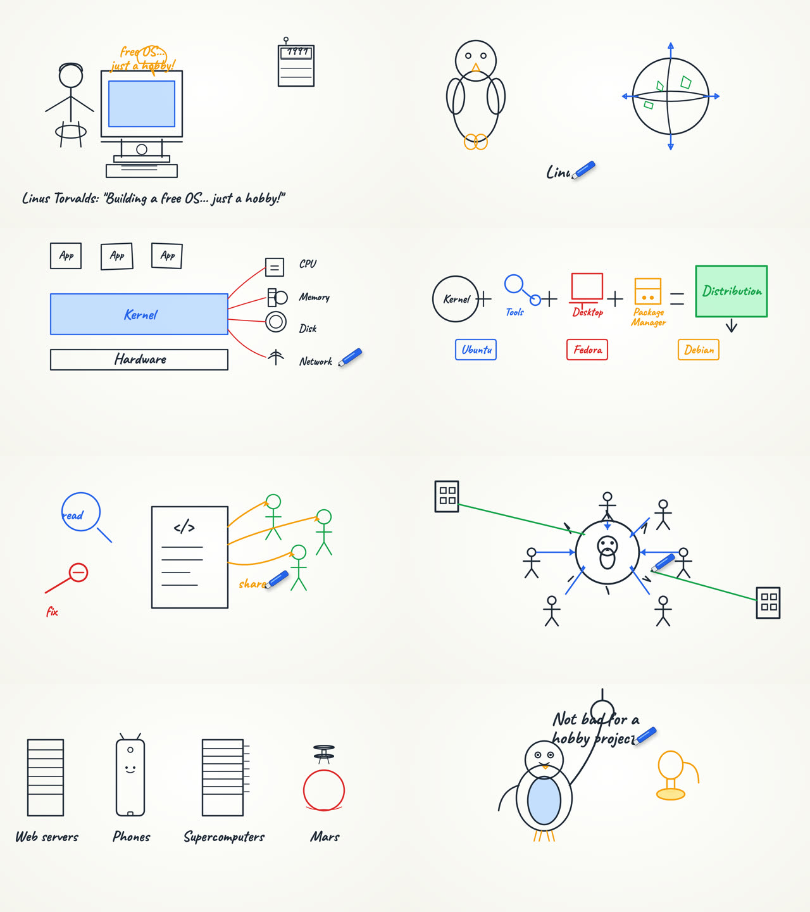

# OpenNotebook, video overview specification

A video overview of a collection's sources: the session's narration over a whiteboard that draws itself. Each idea is sketched at the moment the voice names it, and every label on the board is checked against the sources. It downloads as one MP4 that plays anywhere. This is a plan. Nothing here is built yet.

It rests on a proof of concept run on 2026-10-05 (section 3) and on research done the same day into products, papers, rendering, speech timing and automated checks (section 2). The labels are the ones the [mind map spec](mindmap-spec.md) uses: **Measured**, **Decided**, **Observed**. Two are added here: **Docs** (taken from a vendor's or paper's own documentation, not run here) and **Estimate** (worked out from measured numbers).

## 1. Targets

| | Target | How it is checked |
|---|---|---|
| Quality | Every scene passes the layout lint and the vision checklist (section 4.7). In a pairwise comparison, the board looks as good as the Opus proof of concept. | Lint (deterministic), vision checklist, pairwise judge, the evaluation set (section 7) |
| Accuracy | 100% of on-board labels and numbers appear in the narration or in a cited source passage. Every diagram relation is supported by a passage. | Deterministic string check, one grounding call per video |
| Sync | A drawn element starts within 150 ms of its word at p90 | Word timings from the speech model, measured against the audio |
| Cost | Under $0.25 of model spend for a 5-minute video (about 22 scenes), and about $0.13 in economy mode | Ledger, per video |
| Speed | Under 2 minutes from the press to the MP4 for a 5-minute video when the session is ready, in normal mode | The job's step timings |
| Plays everywhere | Browsers, iOS, Android, WhatsApp, PowerPoint | H.264 + AAC in MP4, `faststart` |

## 2. What the research found

### 2.1 Products (Observed and Docs)

- **NotebookLM Video Overviews** started in July 2025 as narrated slides. Six styles followed in October 2025, one of them Whiteboard, with Explainer (8–10+ min) and Brief (2–3 min) formats and a custom focus prompt. A Veo-based "Cinematic" mode came in March 2026, and 60 s portrait "Short" videos in June 2026. Google's help page warns of "inaccuracies or audio glitches", and users report long sources only partly read. Its visuals are raster images from an image model, so labels can be garbled and nothing on screen is checked. ([Google](https://blog.google/innovation-and-ai/models-and-research/google-labs/video-overviews-nano-banana/), [Help](https://support.google.com/notebooklm/answer/16454555?hl=en))
- **Golpo** is the closest product: a document to a whiteboard video, about 5 minutes to make 2 minutes of video, from $39.99 to $499 a month. ([review](https://outlierkit.com/resources/golpo-review/))
- **VideoScribe and Doodly** are manual whiteboard editors. Synthesia and HeyGen make avatar presenters. Pictory makes stock footage over a voice. None of them ground their visuals in the sources.

**Where we can win:** vector labels that are real text, each checked against a cited passage, drawn in sync with the words, at a few cents a video.

### 2.2 Research systems (Docs)

| System | What it does | What we take |
|---|---|---|
| [Code2Video](https://arxiv.org/html/2510.01174) (ICML 2026) | Planner → coder → critic. The critic is a vision model that sees the rendered frames, and elements snap to a 6×6 anchor grid. | **Ablations:** without the planner −41.5 quiz points, without the asset library −30.0, without the anchor grid −26.8, without the critic −21.3. **Grid:** 6×6 beat 4×4, 8×8 and free placement. **Repairs:** fixing only the broken part cut generation time from 43 to 15 minutes. |
| [TheoremExplainAgent](https://arxiv.org/html/2502.19400) | An LLM writes Manim code for videos up to 10 minutes. $1.16 and about 28 minutes per video. | **Most common defect:** overlapping text. **Judges:** the vision judge agreed with people on visual relevance (ρ 0.72) but hardly on text (ρ 0.15). **Errors:** people found errors in the video that they missed in the text (60% against 0%). |
| [Paper2Video](https://arxiv.org/html/2510.05096) | Renders several layout variants and has a vision model pick one. WhisperX word timings drive a cursor. | **Cursor:** removing it dropped quiz accuracy from 0.633 to 0.084. **Layout:** LLMs are bad at fine numeric layout, so let code do it. |
| [SketchAgent](https://arxiv.org/html/2411.17673v1) (CVPR 2025) | Claude draws stroke by stroke on a labelled 50×50 grid, about $0.05 a sketch. | **Strokes:** each one carries a semantic id. **Failures:** letters, people and complex objects. So text should be typeset, not drawn. |
| [DiagrammerGPT](https://arxiv.org/pdf/2310.12128) | A planner writes entities and boxes, and an auditor fixes the plan before anything is drawn. | **Plan fixes:** they are cheap. |
| [Chat2SVG](https://arxiv.org/html/2411.16602), [Self-Refine](https://www.alphaxiv.org/abs/2303.17651v2), [TikZ verification](https://arxiv.org/html/2606.15693) | Generate → render → critique → fix loops. | **Rounds:** two pay off, more rarely does. **Feedback:** it helps only when it is precise. **Weak drawers:** they gain the most. |
| [VLM judges](https://arxiv.org/abs/2604.25235) | Studies of vision models as judges. | **Reliability:** they rank well but score badly. So we use yes/no checklists and pairwise comparison, never 1–10 scores. |

### 2.3 Learning science, turned into rules (Docs → Decided)

From Mayer's principles ([chapter](https://edtechuvic.ca/wp-content/uploads/sites/11/2022/09/principles-for-reducing-extraneous-processing-in-multimedia-learning-coherence-signaling-redundancy-spatial-contiguity-and-temporal-contiguity-principles.pdf)) and whiteboard studies ([Türkay 2016](https://www.sciencedirect.com/science/article/abs/pii/S0360131516300550), [Fiorella & Mayer 2016](https://www.researchgate.net/publication/281101487_Effects_of_Observing_the_Instructor_Draw_Diagrams_on_Learning_From_Multimedia_Messages), [Zhang 2024](https://doi.org/10.3758/s13421-024-01526-7)):

1. **Draw on the word.** Each element starts as its word is spoken. Temporal contiguity: d ≈ 1.22, supported in 9 of 9 tests. This is the strongest effect, and it is why word timings matter (section 4.2).
2. **Reveal progressively.** Never show a finished diagram. A moving pen tip gives most of the benefit of a drawing hand (Zhang 2024), so the marker stays.
3. **Labels, not sentences.** Graphics plus narration beat graphics plus narration plus the same text on screen (redundancy: d ≈ 0.86, 16 of 16 tests). Labels are 1–3 words next to what they name. **Captions are a soft subtitle track the viewer can switch on, not burned into the picture.**
4. **Signal one thing at a time.** Circle or underline the item being discussed. Signaling: d ≈ 0.41.
5. **One idea per scene, 10–25 s, with chapters.** Segmenting: d ≈ 0.70.
6. **Nothing decorative.** Nothing is drawn that the narration does not mention (coherence).

### 2.4 Word timings (Measured and Docs)

**Speaches cannot give word timings.** Its Kokoro model file outputs audio only (checked by reading the ONNX outputs). **[Kokoro-FastAPI](https://github.com/remsky/Kokoro-FastAPI)** v0.9.0 (Apache-2.0) serves the same Kokoro voices, and its `POST /dev/captioned_speech` returns the audio plus each word's start and end. These come from the model's own predicted durations, so they are exact to about 12 ms (Docs). It is English only. The speech client already lists Kokoro-FastAPI as supported.

Measured on Kokoro audio (30 clips, 3 voices, 381 words), word-start error against Kokoro's own timings:

| Method | Mean | p90 | Within 250 ms | CPU |
|---|---|---|---|---|
| Kokoro's own timings | ~12 ms (Docs) | – | – | none |
| faster-whisper small.en, `word_timestamps` (Speaches can serve this) | 86 ms | 225 ms | 92% | ~6.5 s per clip on an M2, because each clip is padded to 30 s |
| Syllables + punctuation pauses, inside the line's measured span | 135 ms | 268 ms | 88.5% | none |
| Characters only | 156 ms | 381 ms | 81% | none |

The estimate is good enough for captions, but not for drawing on the word.

### 2.5 Rendering and encoding (Measured on an Apple M2, 1920×1080)

| Renderer | Time per frame | Text | Notes |
|---|---|---|---|
| Proof of concept: Chrome screenshots | 37 ms | yes | Chrome in a container with no GPU is unmeasured and likely slower |
| Chrome, 4 pages in parallel | 12–22 ms | yes | |
| **skia-python (BSD-3), SVG to raw frames to ffmpeg** | **9.1 ms including the x264 encode** | **none: Skia's SVG renderer drops text** | Deterministic CPU raster; the same look as Chrome |
| resvg CLI (MIT/Apache) | 91 ms with process start | yes | Best SVG coverage. Good for turning an SVG into plain paths once per scene. |
| cairosvg (LGPL) | 26–104 ms | system fonts only | |
| Remotion | – | – | **Ruled out:** the company licence costs $0.01 a render with a $100 monthly minimum (Docs) |

Encoding the 58 s proof-of-concept video (Measured):

| Encoder | Time | Size | SSIM against the source |
|---|---|---|---|
| libx264 medium, CRF 18 | 22.4 s | 2.8 MB | 0.9997 |
| libx264 veryfast, `-tune animation` | 15.6 s | 2.6 MB | – |
| SVT-AV1 preset 10 | 17.4 s | 2.2 MB | 0.9984 |

Only H.264 in MP4 plays everywhere. VP9 and AV1 fail on WhatsApp and older PowerPoint. libx264 is GPL, and PyAV's wheels bundle x264 and x265 (Measured), so in-process encoding would carry the GPL. Splitting a render by scene and joining the pieces with the concat demuxer (`-c copy`) worked with no re-encode (Measured).

### 2.6 Checks and cost (Measured and Docs)

**Lint works.** A layout lint run in headless Chrome over the 16 proof-of-concept SVGs (Measured, about 6 s):
- **What it checks:** text crossed by strokes, text on text, out of bounds, element count, font size, and how much of the safe area is filled.
- **What it flagged:** the Haiku defects visible in the images. It passed every Opus scene except one 1 px false positive from a descender.
- **Fill ratio:** Opus scenes filled 0.73–0.88 of the safe area, Haiku 0.47–0.60.
- **Blind spot:** it cannot see a crude drawing. That needs the vision check or library icons.

**Output tokens are the cost.** The proof-of-concept SVGs are 51% boilerplate by characters: default attributes, comments and the font name (Measured). A compact scene description of the same scene 4 is 646 characters against 3.7 KB, so **85–90% fewer output tokens** (Measured size, Estimate tokens).

**OpenRouter** (Docs):
- **Caching:** it supports Anthropic prompt caching through `cache_control`. The minimum cacheable prefix is 512 tokens for Sonnet 5.5 and 4,096 for Haiku 4.5.
- **Batch API:** it launched one on 2026-09-22 at about half price, with a median completion of about 7 minutes. Images in a batch must be public URLs.
- **Vision-capable models**, live prices per million tokens:

| Model | Input | Output |
|---|---|---|
| `gemini-3.1-flash-lite` | $0.25 | $1.50 |
| `gpt-5-mini` | $0.25 | $2.00 |
| `claude-haiku-4.5` | $1 | $5 |
| `claude-sonnet-5.5` | $2 | $10 |
| `claude-opus-5.5` | $4 | $20 |

**Icon libraries** that can ship in a self-hosted product (Docs):

| Library | Licence | Notes |
|---|---|---|
| Tabler Icons | MIT | 6.2k stroke icons; they draw on cleanly |
| Lucide | ISC | Stroke icons |
| Doodle Icons | CC0 | About 450, hand-drawn |
| Excalidraw libraries | MIT, per author | Needs attribution, and some include brand logos |
| unDraw | – | **Avoid:** its licence forbids redistributing it as a pack |

## 3. The proof of concept, 2026-10-05

It ran on a one-minute Linux script: 147 words, 30 caption lines, 57.9 s of narration in an Edge TTS voice.

**Stock footage first.** It used [MoneyPrinterTurbo](https://github.com/harry0703/MoneyPrinterTurbo) (MIT) as it ships, which gets clips from Pixabay by LLM-written search terms.
- **Cats (9:16) worked**, though some clips were AI-made stills.
- **Linux (16:9) came out entirely black** (luma 16 on every frame) even though the clips were fine. The fault was intermittent and not found.
- **Observed:** stock footage cannot illustrate an explanation. A "kernel" search returns server rooms. The person asked for "an education video where the speaker draws the things so the attendee understands".

**Then the whiteboard.** The narration was split into 8 scenes on caption lines, one model call per scene drew a free-form SVG (Appendix B), and a ~100-line HTML page animated it:
- `stroke-dashoffset` reveals the shapes, a clip wipe writes the labels, and a marker sits on the tip.
- Headless Chrome screenshotted each frame into libx264, and MoneyPrinterTurbo added the voice and captions.

| | Opus 5.5 scenes | Haiku 4.5 scenes |
|---|---|---|
| 8 scenes drawn, in parallel | about 1 min | 88 s |
| Frames (1,737 at 1080p, 30 fps) | 64 s | not timed |
| Assembly in MoviePy | ~3 min | ~3 min |
| Darkest frame (luma) | 217 | 221 |
| Cost through the `claude` CLI on a subscription (billed $0), at API prices | $0.168 for one scene; about 24k of the input tokens were the CLI's own prompt | $0.415 for 8 scenes; 56,882 output tokens for about 12k of SVG |




**Observed:**
- **Opus:** the person called the Opus video "amazing".
- **Haiku, diagrams:** its diagram scenes are clear.
- **Haiku, illustrations:** its illustrated scenes are crude, with stick figures and a red circle for Mars, and text crosses lines in scenes 1 and 8.
- **Sync:** each scene finished drawing at 78% of its time, so Mars was still being drawn after "Mars" was said.

### Issues found, and where this plan answers them

| Issue | Answered in |
|---|---|
| Stock clips did not match the script | No stock footage at all (4.4) |
| One render was all black, intermittently | Black-frame and duration check on every output (4.7) |
| Pexels had stopped issuing keys | No third-party media service (4.4) |
| Drawing lagged the voice | Word-timed beats (4.2, 4.6) |
| Kokoro gives no word timings through Speaches | Kokoro-FastAPI captioned speech, with fallbacks (4.2) |
| Text crossed lines; Haiku drew crude illustrations | The model no longer places pixels: a compiler lays out (4.4), plus lint, vision check and repair (4.7) |
| Marker cut off; zero-length shapes showed as dots | The renderer owns all geometry (4.8) |
| The CLI's token overhead; free-form SVG is half boilerplate | Direct calls, compact scene JSON (4.4, 5) |
| MoviePy took 3 minutes | skia frames piped to ffmpeg, in parallel by scene (4.8) |
| Font loaded from the network | Fonts bundled, converted to paths (4.5) |
| Captions burned in | Soft subtitle track (4.9) |

## 4. Design

### 4.1 Pipeline

A ready session (script, narration, timings) goes through these stages:

| # | Stage | Model or tool | Cost |
|---|---|---|---|
| 1 | Timeline (4.2) | none | free |
| 2 | Scene plan (4.3) | one call per video, with source passages | one call |
| 3 | Scene writer (4.4) | one call per scene, in parallel, returning scene JSON | ~300 output tokens per scene |
| 4 | Compiler (4.4, 4.5) | none | free |
| 5 | Checks (4.7): layout lint, then grounding check, then vision checklist | lint: none; grounding: one call per video; vision: one call per scene | see section 5 |
| 6 | Repair (4.7) | only failing scenes, at most 2 rounds, then escalate, then a plain fallback | only when needed |
| 7 | Renderer (4.8): per scene, skia frames into an ffmpeg segment | none | free |
| 8 | Join (4.8): concat, mux the episode audio, add chapters and the subtitle track, validate | none | free |

The output is `video/<sid>/<style>.mp4`.

### 4.2 Timeline

Everything is timed from one place, so the video, the episode WAV and the player cannot drift apart:
- **Line starts:** they come from the same `episode_plan` that joins the episode WAV (`build/wav.py`): gaps of 220, 320 and 650 ms, plus each line's measured duration.
- **Word times:** they come from the speech model and are stored in `Line.cues` as `{word, start_ms, end_ms}` relative to the line. The field exists and is empty today.

Fallback order for word times (Decided):
1. **Kokoro-FastAPI `/dev/captioned_speech`**, called in place of `/audio/speech` during narration. Timings are exact and add no CPU. Words with no timing (outside Kokoro's lexicon) are interpolated between their neighbours.
2. **faster-whisper word timestamps** from the existing transcription server, with the line text as the prompt and words snapped onto the known script. To avoid the 30 s padding per clip, several lines are sent together and split back by their known lengths.
3. **Syllables + punctuation** inside the measured line span. When this is the source, drawing is timed to the line, not the word, so its p90 error of 268 ms never shows as a late stroke.

The same timings also give word highlighting in the transcript and karaoke captions in the player.

### 4.3 Scene plan and grounding

**Inputs:** one call (`VIDEO_PLAN_MODEL`, Haiku 4.5 by default) gets the parts (`title`, `on_slide`, lines with ids) and, for each part, the passages retrieval already finds for the script (`script/retrieval.py`), each with an id.

**What it returns for each scene:**
- **Lines:** the narration lines it covers. A part becomes 1–3 scenes, aiming for 10–25 s each.
- **Layout:** a layout family: `stack`, `flow`, `hub`, `compare`, `equation`, `timeline`, `cycle`, `illustration` or `free`.
- **Concepts:** the things to draw, each tied to the word that names it (`line_id` plus a word index).
- **Claims:** what the scene asserts, each with the ids of the passages that support it. A scene with a claim and no passage is flagged before any drawing.

Prerequisites go first: if a scene uses a concept that a later scene introduces, the planner reorders or adds a setup beat (Math-To-Manim's "what must I know first"). Script lines carry no citations today (only Q&A and notes do), so the plan is where the video gets its grounding.

### 4.4 Scene JSON and the compiler

The scene writer (`VIDEO_MODEL`, Sonnet 5.5 by default) never writes pixels. It returns a compact scene in the schema in Appendix A. The fields:

| Field | What it holds |
|---|---|
| `elements` | Each element is one of `icon`, `box`, `circle`, `label`, `arrow`, `brace`, `number`, `group` or `sketch` |
| `at` | A cell on a **6×6 anchor grid**, plus an optional span. Code2Video measured that 6×6 beats free placement. |
| `beat` | The word it is drawn on: `{line, word}` |
| `tone` | One of 4 accents |
| `highlight` | Which elements to signal, and when |

**What the compiler does.** It is deterministic, written in Python, and owns everything else:
- **Grid to pixels:** grid cells to coordinates inside the safe area (x 80–1840, y 60–960 of 1920×1080, leaving the bottom for subtitles when a player draws them).
- **Icons:** `icon` ids are resolved against a bundled library: Tabler (MIT) and Lucide (ISC) stroke icons, plus Doodle Icons (CC0). Retrieval by name and tags gives the writer 8 candidates per concept, so it picks from icons that exist.
- **Labels:** placed by a collision-free placer next to their element (above, below, then sides), and shrunk down to a minimum size before they may collide.
- **Arrows:** routed as gentle curves between element edges, avoiding other boxes.
- **Drawing order:** it follows `beat` time. Elements on the same beat are drawn outline first, then details, then label.
- **Escape hatch:** `sketch` is a bounded free-form path group (at most 1 per scene, at most 2 cells) for what no icon covers. It is normalised to plain paths with resvg's `usvg`, then linted like everything else.

Because the compiler knows every glyph's outline (4.5) and every element's box, the lint is exact geometry in Python. No browser is needed.

### 4.5 The hand-drawn look

- **Strokes:** each path gets a seeded rough.js-style treatment: a little jitter on control points, an occasional second pass, and round caps. Seeded per element, so a re-render is identical.
- **Width:** stroke width tapers at the ends of a pen stroke, perfect-freehand style (MIT), simulated from drawing speed.
- **Labels are written, not wiped in.** They use a single-line handwriting font whose glyphs are open paths in pen order, so the dashoffset reveal writes them stroke by stroke. Relief SingleLine (OFL) and the EMS Hershey-derived fonts (OFL, checked per font) are the candidates.
- **Fonts become paths:** with fontTools at compile time. This also fixes Skia's missing text. Caveat (OFL), an outline font, remains for titles that are wiped in.
- **Palette:** one fixed whiteboard palette (ink `#1f2937`, blue, red, amber, green, plus 4 highlight washes) checked to WCAG AA on the board colour, as the slide kits are.
- **Non-Latin languages** need a single-line font per script. Until one exists, labels in such a language are wiped in with an outline font, which still works.

### 4.6 Animation rules

- **Beats:** an element starts at its word's `start_ms` minus 120 ms, because the pen starts as the word begins. It draws at a speed set by its path length, clamped to 0.35–1.6 s, and is finished before the next beat starts.
- **Speech-free time:** time without speech before a scene's first beat is used for the title or for nothing. The board never fills ahead of the voice.
- **Signaling:** one highlight at a time (an underline, a circle or a wash) on the element being discussed, starting on its word.
- **Wipes and holds:** the board is wiped in 300 ms between scenes. A scene whose last beat ends early holds its finished state, so the board never gets busier than the narration.
- **The marker** follows the tip of whatever is being drawn and lifts off between strokes. It parks off the board while nothing is drawn.

### 4.7 Checks and the repair ladder

Each check names exactly what to fix, because research finds feedback helps only when it is precise:

| Check | What it catches | Cost |
|---|---|---|
| **Layout lint** (compiler geometry) | Text crossed by strokes (glyph outlines against stroke outlines, with a 6 px tolerance), text on text, out of bounds, font below the minimum, element count outside 4–40, fill ratio below 0.55 | free |
| **Label grounding** (deterministic) | Every label and number must appear in the scene's narration or in a cited passage: normalised, lemmatised, and numbers compared by value. A label that does not match is a failure, never a warning. | free |
| **Claim grounding** (one call per video, Haiku 4.5) | Each scene's relations ("A → B: manages") and claims, judged SUPPORTED, UNSUPPORTED or INSUFFICIENT against their passages. Small distortions count as UNSUPPORTED. | ~$0.02 |
| **Vision checklist** (the final frame at 800×450) | Yes/no questions: is each concept in the plan visible and recognisable? Is any text unreadable or covered? Does the board show what the narration says? Each "no" returns a short fix. | ~$0.01 a video on `gemini-3.1-flash-lite` |
| **Output check** | ffprobe duration within 100 ms of the episode, no second averaging near black (luma < 24), audio present, H.264/AAC/yuv420p | free |

**The repair ladder, for failing scenes only:**
1. Send the scene JSON plus the exact failures back to the writer, at most 2 rounds.
2. Escalate once to `VIDEO_ESCALATE_MODEL` (Opus 5.5).
3. Fall back to a plain scene built by the compiler from the part's title and `on_slide` points with matching icons, as the slides do with `plain_slide`.

A video never fails because of one scene.

### 4.8 Renderer and encode

- **Frames:** skia-python draws each frame from the compiled scene, with path lengths measured once per scene. Measured: 9.1 ms per frame at 1080p including the encode, against 37 ms for the proof of concept's Chrome.
- **Segments:** one ffmpeg subprocess per scene, `libx264 -preset veryfast -tune animation -crf 20 -pix_fmt yuv420p`, raw RGBA piped in. Scenes render in parallel across processes, and the segments are joined with the concat demuxer, `-c copy`.
- **Mux:** the episode WAV is encoded to AAC, chapters come from scene titles, the soft subtitles go in as `mov_text`, and `+faststart` is set.
- **Licensing:** ffmpeg is a separate executable in the worker image, called as a subprocess and never linked. The GPL's text and an offer of its source ship with the image. A permissive build (Cisco OpenH264) is the alternative if a customer needs one (section 10).
- **Chrome stays out of the worker.** It remains only as a debugging tool to preview a scene.

### 4.9 What the person gets

- **The file:** an MP4 (1920×1080, 30 fps, H.264 + AAC) with chapters and a subtitle track that is off by default, plus a `.vtt` file for players that want one.
- **In the app:** a Video choice on the output's card and in the player's download menu, with the estimate and the render's progress.
- **Styles:** **Whiteboard** (this spec) and **Slides**. Slides plays the existing deck in time with the narration, needs no model calls, and is built first because it proves the timeline, encoder and download.

## 5. Cost

A 5-minute video with about 22 scenes. Prices per million tokens, input/output, from OpenRouter on 2026-10-05.

| Stage | Model | Tokens | Normal | Economy (batch) |
|---|---|---|---|---|
| Scene plan | Haiku 4.5 ($1/$5) | ~8k in, ~3k out | $0.023 | $0.012 |
| Scene JSON, 22 calls | Sonnet 5.5 ($2/$10) | ~1.5k in, ~350 out each | $0.143 | $0.072 |
| Claim grounding | Haiku 4.5 | ~12k in, ~1.5k out | $0.020 | $0.010 |
| Vision checklist, 22 frames | gemini-3.1-flash-lite ($0.25/$1.5) | ~1.6k in, ~150 out each | $0.014 | $0.014 (no images in batch) |
| Repair, ~25% of scenes, 1 round | Sonnet 5.5 | | $0.040 | $0.020 |
| Escalation, ~1 scene | Opus 5.5 ($4/$20) | ~2k in, ~600 out | $0.020 | $0.010 |
| Narration timings, render, encode | local | | $0 | $0 |
| **Total** | | | **~$0.26** | **~$0.14** |

All of these are Estimates from the measured token sizes in sections 2.6 and 3. Phase 0 measures them.

**To get normal mode under $0.25:**
- **Caching:** cache the writer's fixed prefix (rules, schema, icon catalogue: well over 512 tokens, so cacheable on Sonnet), which takes ~$0.02 off.
- **Cheaper writer:** if the bake-off allows, use `gemini-3.8-flash` ($0.75/$3.75) as the writer, about $0.06 for the scene JSON.

**Comparison:** the proof of concept's route, Opus writing free-form SVG, would cost about $1.54 for the same video.

## 6. Speed

| Step | Normal | How |
|---|---|---|
| Plan | ~10 s | one call |
| Scene JSON | ~15 s | 22 calls in parallel |
| Checks and repairs | ~20 s | vision calls in parallel, at most 2 repair rounds |
| Render 9,000 frames | ~25 s | 9 ms a frame across 4 processes (Measured per frame; Estimate in parallel) |
| Encode audio, join, validate | ~5 s | `-c copy` concat |
| **Total** | **~75 s** | |

Economy mode adds the batch wait (median about 7 minutes, Docs). Narration timings add nothing with Kokoro-FastAPI. The faster-whisper fallback adds about 1 minute of CPU per minute of audio on an M2 (Measured).

## 7. Evaluation

**An evaluation set.** 12 collections chosen to stress different scene types: a process, a comparison, a history, numbers-heavy, a science concept, code, a person-centred story, non-English, and a 1-page note. Each gets a 5-minute video.

| Metric | Bar | Source |
|---|---|---|
| Scenes passing lint on the first try | ≥ 85% | lint |
| Labels grounded | 100%, after repairs | label check |
| Claims SUPPORTED | ≥ 98%, the rest repaired or removed | claim check |
| Sync, element start against its word | p90 ≤ 150 ms | timings |
| Pairwise against the Opus proof of concept, same script | win or tie ≥ 70% | vision judge, pairwise, both orders |
| Quiz score ([TeachQuiz](https://arxiv.org/html/2510.01174)-style, a model answers questions from the video's frames and audio transcript) | above the Slides style on the same session | evaluation script |
| People | 5 people rate 6 videos each: clarity, accuracy and "would share", 1–5 | form |
| Cost and time | within sections 5 and 6 | ledger, job steps |

The set runs on every change to a prompt, the compiler or a model setting, as the audio overview's prompts are tested in both shapes.

## 8. Decisions

| Decision | Choice | Basis |
|---|---|---|
| Visual source | Drawn line art only; no stock footage, no image-generation model | Observed in the proof of concept; image models garble text (2.1) |
| What the model writes | Scene JSON on a 6×6 grid, not SVG | Code2Video's grid ablation; 51% boilerplate measured; LLMs are poor at numeric layout (Paper2Video) |
| Who places pixels | The compiler | Decided. Lint can then be exact. |
| Icons | Tabler, Lucide and Doodle Icons, bundled, retrieved per concept | Code2Video's asset ablation (−30); licences (2.6) |
| Writer model | Sonnet 5.5, as a setting, with a Gemini 3.8 Flash bake-off in phase 0 | Opus-like quality at half the price is the judgement; measured in phase 0 |
| Planner and grounding model | Haiku 4.5 | The studio's script model; the work is text |
| Vision checklist model | gemini-3.1-flash-lite, as a setting | Cheapest vision model; yes/no only (2.2) |
| Word timings | Kokoro-FastAPI captioned speech, then faster-whisper, then the syllable estimate | Measured (2.4) |
| Renderer | skia-python, with text converted to paths | Measured 4× faster than Chrome; deterministic; no browser in the worker |
| Encoder | ffmpeg subprocess, libx264, MP4 | Only H.264 plays everywhere (2.5); a subprocess keeps the GPL out of our code |
| Captions | A soft subtitle track, off by default | Redundancy principle (2.3) |
| Music | None | Coherence principle; licensing |
| Failure policy | Repair, escalate, then a plain scene; never fail the video for one scene | As the deck does today |

## 9. Where it lives

All under `server/opennotebook/`, from the code map of 2026-10-05.

- `speech/__init__.py`: a `synthesize_timed(text, voice) -> (wav, words)` that calls `/dev/captioned_speech`, falling back to `synthesize` plus transcription. `build/narrate.py`'s `synthesise_line` fills `Line.cues`. Audio overviews and decks gain word timings too.
- `build/timeline.py` (new): line and word times from `wav.episode_plan`. `api/media.py` has its own copy of the gap and join code (`:39-45`, `:178-230`), which this replaces, so there is one timeline.
- `build/video/plan.py`, `writer.py`, `compiler.py`, `icons.py`, `lint.py`, `ground.py`, `judge.py`, `render.py`, `encode.py`: the stages of 4.1. The bundled assets (icons, fonts) go in `build/video/assets/` with a `LICENSES.md`.
- `db/models.py`: a `video` JSONB column on `Session`, `{style: {state, path, failure, spent_usd, steps}}`, in migration `0007`. A ready session stays ready while a render fails.
- `jobs/tasks.py`: a `render_video` task on its own `render` queue and lock, with `Progress` steps `plan`, `scenes`, `check`, `render` and `encode`, and cancellation through `jobs.stop()`.
- `api/sessions.py`: `POST /sessions/{sid}/video {style, economy}` checks the estimate (`refuse_over_limit`) and queues the task. `api/media.py`: `GET /sessions/{sid}/video?style=`, streamed from the file with the existing `_ranged`. The share variant goes alongside the episode's.
- `domain/sessions_estimate.py`: a `GROUP_VIDEO` group built like `slide_design`.
- `domain/settings.py`: `VIDEO_MODEL`, `VIDEO_PLAN_MODEL`, `VIDEO_JUDGE_MODEL`, `VIDEO_ESCALATE_MODEL` and `VIDEO_ECONOMY`, built like `SLIDE_MODEL_KEY`.
- `tests/builds/test_video.py`: on `fake.py`. Golden scene JSON compiled to frames with pixel hashes, lint cases from the proof-of-concept SVGs, the timeline against the episode WAV, and an end-to-end render of a two-scene session with fake models.
- `web/`: the Video choice, the progress, the player's download menu and the subtitle toggle.
- Docker Compose: a `kokoro` service (Kokoro-FastAPI) next to `speaches`. The worker image gains ffmpeg and the skia-python wheel.

## 10. Licences

| Part | Licence | Note |
|---|---|---|
| skia-python | BSD-3 | |
| resvg / usvg | MIT or Apache-2.0 | |
| svgelements, fontTools | MIT | |
| ffmpeg with libx264 | GPL-2+ | Separate executable; GPL text and source offer shipped. OpenH264 (BSD-2, Cisco binary downloaded at install) is the permissive option. H.264 patent licensing is a separate question for legal. |
| Kokoro-FastAPI, Kokoro weights | Apache-2.0 | |
| faster-whisper | MIT | |
| Tabler / Lucide / Doodle Icons | MIT / ISC / CC0 | Licences listed in `assets/LICENSES.md` |
| Relief SingleLine, Caveat, EMS fonts | OFL-1.1 (EMS checked per font) | |
| Not used | | Remotion (company licence), unDraw (no packs), PyAV wheels in-process (bundled x264/x265), ctc-forced-aligner's default model (CC-BY-NC) |

## 11. Risks and open questions

- **The writer's quality on illustrations.** A grid and icons make diagrams good. A scene that needs a picture (a person, Mars) relies on `sketch` or a near icon. The phase 0 bake-off measures this on the 8 proof-of-concept scenes.
- **Kokoro-FastAPI next to Speaches.** It is a second speech container. If it stays, Speaches could serve speech-to-text only. Its timestamp keys are `start_time`/`end_time` in the docs but `start`/`end` in an example, so phase 0 checks a live server.
- **Non-English.** Kokoro's timings are English-only. Other languages fall back to faster-whisper (multilingual) or line-level timing. Single-line fonts beyond Latin are open.
- **Two hosts.** The proof of concept had one narrator. The plan is a speaker tag in the speaker's colour from [design](design.md). Untested.
- **The vision judge's reliability.** It ranks well and scores poorly (2.2), so it only gates on yes/no checks, and the pairwise comparison runs in both orders.
- **Self-hosting and the GPL ffmpeg.** See [open questions](open-questions.md).

## 12. Phases

| Phase | What | Done when | Size (Decided, a range) |
|---|---|---|---|
| **0. Spikes** | Kokoro-FastAPI captioned speech on the box (keys, accuracy, speed); skia frames with fontTools text-to-paths and a single-line font; the compiler for 3 layout families; a writer bake-off (Sonnet 5.5, Gemini 3.8 Flash, Haiku 4.5) on the 8 proof-of-concept scenes, judged by lint and pairwise; OpenRouter batch and caching on one real call; ffmpeg in the worker image | Each has a written yes or no, with numbers, in this doc's amendments | 1 week |
| **1. Timeline and the Slides video** | `build/timeline.py` (replacing media.py's copy), word timings in narration, `render`/`encode`, the `video` column, the routes, the download, the output check | A 5-minute session downloads as a Slides MP4 that plays on iOS, Android and in PowerPoint, with chapters and subtitles | 1 week |
| **2. Whiteboard core** | Plan, writer, compiler (all layout families), icons, hand-drawn look, beat animation, parallel render | The evaluation set renders end to end, inside the cost and time budgets, with lint passing ≥ 85% on the first try | 2–3 weeks |
| **3. Accuracy and repair** | Label and claim grounding, the vision checklist, the repair ladder, plain-scene fallback, economy mode | 100% of labels grounded and ≥ 98% of claims supported on the evaluation set | 1–2 weeks |
| **4. Evaluation and polish** | The evaluation set in CI, the quiz metric, the people's review, the UI | Every bar in section 7 is met | 1 week |

About 6–8 weeks for one engineer. Phase 1 is useful on its own.

## Amendments

### 2026-10-05, research

The first version of this spec, written right after the proof of concept, proposed:
- free-form SVG per scene;
- Chrome screenshots;
- captions drawn on the board;
- each element group timed to its narration line;
- a Sonnet default chosen by judgement.

Research the same day changed six things:
1. **Scene JSON with a compiler replaces free-form SVG.** Grid and asset ablations; 51% boilerplate measured; lint passes when the compiler owns layout.
2. **skia-python replaces Chrome.** 9.1 ms against 37 ms per frame, measured; no browser in the worker.
3. **Captions become a soft track.** The redundancy principle.
4. **Elements are timed to their word, not their line.** Temporal contiguity is the largest effect, and Kokoro-FastAPI gives exact word times.
5. **Grounding is added.** Labels checked deterministically, claims checked once per video. Script lines carry no citations, so the plan cites passages.
6. **A cost budget per stage replaces a single estimate.**

### 2026-10-05, phase 1 built: timeline and the Slides video

**Built:**

| Piece | Where |
|---|---|
| Word timings | `speech.Speech.synthesize_timed`, through Kokoro-FastAPI's captioned route, falling back on servers without it; stored in `Line.cues`; setting `OPENNOTEBOOK_TTS_TIMESTAMPS` |
| One timeline | `build/timeline.py`, now behind the episode download too; `api/media.py`'s copy of the join is gone |
| Renderer | `build/video.py`: slides drawn by a browser, title cards for audio overviews and missing slides, ffmpeg as a subprocess, then a check of streams, length, chapters and black frames |
| Queue | `render` |
| Routes | `api/video.py`: make, list states, play or download with ranges, WebVTT captions, share routes |
| Storage and settings | Migration `0007` (`Session.video`); settings `OPENNOTEBOOK_FFMPEG`, `OPENNOTEBOOK_FFPROBE`, `OPENNOTEBOOK_BROWSER_CHANNEL` |

**Measured** in an end-to-end test against a real API and worker, with 4 parts and 8 lines of macOS speech:

| Check | Result |
|---|---|
| Length against the episode WAV | 0 ms apart |
| Audio offset (cross-correlation) | 0 ms |
| Chapters | at the computed boundaries |
| Slide changes | −24, +13 and +23 ms off: one frame at 30 fps |
| Captions | equal to the narration |
| Ranges and downloads | 206 and 416 correct |
| Access | shares readable; another user refused |
| Render time | 4 phases in 5.7 s for 27.5 s of narration |
| Stopping | a delete mid-render aborted it, with no files or browser left behind |

The suite runs 25 video tests, two of them real renders.

**Fixed after review**, from a code review, an edge-case fuzz (about 8,000 random episodes) and the end-to-end test:
- **Chapters lost:** a title ending in `\` lost a chapter, so the render always failed. A `\r` cut titles short.
- **No captions:** an episode with nothing to caption could not encode.
- **Timing drift:** lengths rounded to the ms drifted from the joined audio by up to about 230 ms an hour, and cut the end of the narration. The timeline now uses exact sample lengths.
- **Stuck renders:** a render whose job ended without saying so stayed "rendering" for good. Renders are now checked against the queue's own record, as builds are, and say when no worker is running.
- **Re-render failures:** a failed re-render hid the good video already made. The previous video now plays on while its successor is made, and after it fails.
- **Late files:** files written after a mid-render delete were kept for good.
- **Captions:**
  - A clause-ending word could become a caption of its own.
  - Captions could overlap or run past the end.
  - Words without letters ("&", "<") were dropped.
  - Cue text was not escaped.
- **Word timings:**
  - Server timings were trusted when only the word count matched.
  - One untimed word discarded a whole line's timings. Cues are now aligned word by word, and gaps are interpolated between their neighbours.
  - NaN, infinite and boolean times broke a line.
- **Error text:** a job's error could show a server file path.

**Known limits:**
- **Captions may show at first.** ffmpeg's MP4 muxer enables the first subtitle track whatever disposition is asked for, so some players show captions from the start. The web player should use the `.vtt` file, off by default.
- **Untested:**
  - playback on iOS, Android, WhatsApp and PowerPoint, which needs devices;
  - word timings from a live Kokoro-FastAPI;
  - a session longer than a few minutes.
- **Collection deletes leave files.** Deleting a collection neither stops its outputs' renders nor removes their deck, audio or video files. This gap existed before the video work.

### 2026-10-06, phase 2 built: the whiteboard video

**Built** (`server/opennotebook/build/whiteboard/`):

| Piece | What it does |
|---|---|
| `scene.py` | The scene and plan schema of Appendix A. Unknown `layout` and `tone` values become `free` and `ink` instead of rejecting the scene. |
| `icons.py` | Tabler's 5,184 outline icons (MIT), bundled at 340 KB, with search by name, tags and category. Name matches rank first, and plurals ("leaves" → leaf) and compounds ("sunlight") are handled. |
| `geometry.py` | Turns SVG paths and glyphs into sampled point lists with a seeded wobble. Labels use Caveat (OFL) converted to outlines. A letter Caveat lacks comes from a system font that has it; scripts that need shaping are reported, not drawn wrong. |
| `compile.py` | Places elements on the grid. Arrows join the drawn content, not the cells. Each piece starts on its word, but never later than leaves room for the pieces after it. |
| `lint.py` | Exact geometry checks: crossed labels, overlapping labels, shared cells, short arrows, off-board, sparse boards. |
| `write.py` | The plan and scene prompts, the first JSON object of a reply, up to two repair rounds with the exact faults named, and a plain fallback flow. |
| `draw.py` | skia frames, one child process per scene. A hold of 15 frames or more is encoded from a single frame. |

**Also changed:**
- **`video.py`:** the `whiteboard` style. Each scene is drawn as soon as it is written.
- **Model setting:** a `OPENNOTEBOOK_VIDEO_MODEL` setting, Sonnet 5.5 by default.
- **Spending:** recorded in the ledger as `video`.

**Measured:**

*Linux script, 58 s, Sonnet through the `claude` CLI:*
- 6 scenes, 4 to 6 right first time across runs;
- 43–68 s from narration to MP4;
- about 7,000 output tokens, roughly $0.09 at API prices. The CLI's own cost figure is mostly its system prompt.

*Photosynthesis, a topic nobody tuned for, Sonnet:*

| | Before the fixes below | After |
|---|---|---|
| Scenes right first time | 2 of 8 | 4 of 5 |
| Drawn plain | 3 | 0 |
| Output tokens | 12,471 | 8,080 |
| Render time | 4.5 min | 58 s |

*HTTPS, before the fixes, Sonnet:* 1 of 6 right first time, 2–4 drawn plain.

*Haiku through the CLI:* 3 to 4 scenes per video, far fewer than Sonnet; the plain fallback ranged from 0 to 1. Its CLI runs took 8 to 10 minutes with 80,000 to 100,000 output tokens. That is the CLI, not the pipeline, and it needs measuring through the API before Haiku can be judged.

*A 5.35-minute narration, 22 scenes laid out by the studio (no model):*
- drawing and encoding took **145 s → 65 s** once long holds were encoded from one frame, and **61 s** once drawing overlapped writing;
- 9,633 frames, exactly `round(total × 30 / 1000)`;
- 8.3 MB;
- peak memory about 0.5 GB.
- **Why holds mattered:** piping and colour-converting a frame is 5.6 of its 6.5 ms, and 70% of a whiteboard's frames repeat the frame before them.
- **Parallelism:** more scene processes barely helped (12.4 → 10 ms a frame), because the shared cost is that conversion.

**Fixed after testing:**
- **Clipped labels:** a label's last letter was cut. Letters reach past their advance width.
- **Invisible arrows:** arrows between cells that touch at a corner were about 13 px long.
- **Too-fast strokes:** the pen was sped up until strokes took 1 ms when words came late.
- **Unseen drawing:** a scene's last drawing was wiped as it finished. A scene now holds through the pause after its last line.
- **Wrong icons:** "Mars helicopter" drew the ♂ sign (Tabler's `mars`); "web server" drew a brand logo; "leaves" drew a logout arrow. Candidates are now shown to the model with their category.
- **Rejected scenes:** a sentence written in `layout` rejected the whole scene, and so did a second JSON object after the first.
- **Crash:** an arrow from an element to itself crashed the compiler (271 times in 3,000 fuzzed scenes; none now).
- **Lost element:** an element given an id lost another element that already had that id.
- **Empty shapes:** a box or circle with no label was accepted. It now goes back for repair.

**Known limits:**
- **Icon choice is still loose at times.** "Air" drew a hot-air balloon and "water" a cup. A vision check (phase 3) is the next guard.
- **Some scripts are not drawn.** Arabic, Hebrew and the Indic scripts need a shaping engine (HarfBuzz) and are not drawn yet. Chinese, Japanese and Korean need a system font, so a server image should carry Noto CJK.
- **Speed target missed with a model.** A 5-minute video with a model is about 2 minutes end to end on an 8-core Apple M2, against a target under 2. Drawing alone is 61 s.
- **Not done yet:** claim grounding and the vision checklist, which are phase 3.

### 2026-10-06, phase 3 built: accuracy and the repair ladder

**Built** (`server/opennotebook/build/whiteboard/`):

| Piece | What it does |
|---|---|
| `ground.py` | Every label and figure on a board must come from the scene's narration or its source passages: words with their plurals, numbers by value ("75 percent" is "75%"). Free and deterministic. Titles are headings and are exempt: a real run had two scenes drawn plain over "Making Sugar" alone. |
| `check.py` | One call per scene to an image-reading model (Haiku 4.5 by default, `OPENNOTEBOOK_VIDEO_CHECK_MODEL`). It gets the finished board drawn at 960×540, the scene's claims, its arrows written out as sentences ("leaf releases oxygen"), the things it draws, the narration and the passages. Its answer is in two parts, described below. A checker that is down does not stop the video; the scene is counted as unchecked. |
| Passages | Each scene gets up to 8 passages and 4 question-and-answer facts, from the script's own `retrieve` on the scene's title, brief and narration. The prompt shows them with ids, and the scene cites them in `claims`. |
| The ladder | Two repairs with the exact faults named, then one try by `OPENNOTEBOOK_VIDEO_ESCALATE_MODEL` (Opus 5.5 by default), then the plain fallback, whose words are grounded too. |
| Recorded on the video | Pieces of text and how many are grounded; claims and how many are supported; scenes repaired, escalated, plain and unchecked. |

The check's answer is split:
- **Claims are faults.** They are judged against the narration and the passages only, never the picture.
- **The picture's findings are advice.** These are things not recognisable, text not readable, and anything the narration contradicts. Advice is sent back once, and a later answer stands on its claims.
- **Why the split:** the first strict version refused scenes because the checker misread an arrowhead, and because the board did not draw every noun the narration said. Three of four scenes went plain, in 252 s and 15 write calls.

**Measured on photosynthesis**, with Sonnet writing and Haiku checking through the `claude` CLI, against a real six-paragraph source:

| | Run 1 | Run 2: checker too strict | Run 3: as built |
|---|---|---|---|
| Scenes right first time + repaired | 1 + 1 | 0 + 1 | 1 + 3 |
| Escalated | 0 | 0 | 0 |
| Drawn plain | 2 of 4 | 3 of 4 | **0 of 4** |
| Labels grounded | 23 / 23 | 20 / 20 | **33 / 33** |
| Claims supported | 14 / 14 | 6 / 6 | **33 / 33** |
| Write calls + check calls | 13 + 4 | 15 + 10 | 9 + 6 |
| Time, narration to MP4 | 145 s | 252 s | 145 s |

Run 1 was before titles were exempt and short arrows were drawn at a minimum length.

**The check caught two real errors before they were drawn:**
- "leaf releases air": the source says the leaf releases oxygen into the air.
- "carbon dioxide joins glucose": hydrogen is joined with carbon dioxide to build glucose.

Both were repaired.

**Also fixed:**
- **Short arrows:** an arrow between neighbouring elements was 2–25 px long, and neither Sonnet nor Opus repaired it when told to leave a free cell. It is now drawn at 70 px about its midpoint.
- **A missing field:** the video state's `repaired` count was stored but not served.

**Not done in phase 3:**
- **Economy mode** (the batch API, at half price) is not built. OpenRouter's batch takes images by public URL only, and the check sends each board inline.
- **Cost through the API is unmeasured.** Every model call here went through the CLI, whose own overhead dominates its cost figures. Six check calls and nine write calls for 62 s of video is the number to price.

### 2026-10-06, a presenter's voice, and the first run on the real pipeline

**Why.** The person reviewing the photosynthesis video found it "too AI generated, the script and voice are not smoothed at all". The test narration was cut into half-sentence lines, and each line was voiced on its own by macOS `say`. So every sentence broke in two, and the intonation restarted after each pause. The Linux video they liked was cut from one continuous recording.

**Built: `build/whiteboard/presenter.py`.** A whiteboard now has its own narration, as one person would say it while drawing.
- **Written to be spoken.** One call (the video model) rewrites the script for one teacher talking to a curious friend: complete sentences, contractions, mostly short sentences, sparing signposts, and no stock phrases ("dive in", "unpack", "in today's video").
- **Same facts.** Every fact, number and name is kept and none is added. A rewrite is refused when a part is missing, or is outside 0.6–1.6× the script's length, or has a number or a name the script lacks. It is asked again once, then replaced by the script's own words joined into whole sentences.
- **Voiced a paragraph at a time.** One to three sentences, up to 45 words, are one clip, so the voice carries its intonation across sentences. Word timings come from the speech server.
- **Separate from the session.** The voice is the session's first speaker's. The files live under `video/<sid>/voice/`, and the session's own narration is untouched.
- **Every video's audio is levelled** to −16 LUFS, the loudness of spoken video on the web.

**First run on the real pipeline**, on a 4-core test machine: "Vaccines in four slides", a session the studio built from real sources. It ran through OpenRouter, Microsoft's Edge neural voice (Ava Multilingual) with its word timings, and retrieval from the collection.

| | |
|---|---|
| Video | 3 min 8 s, 4 chapters, 7.2 MB, served by the API |
| Time, press to MP4 | 137 s. Rewrite 6 s, recording 33 s, plan 5 s, scenes 62 s, drawing 12 s, encode and check 17 s. |
| Scenes | 6: 3 right first time, 2 repaired, 1 by Opus, 0 plain |
| Words timed | every word measured by the speech server |
| Labels grounded | 51 / 51 |
| Claims supported | 38 / 38. The check refused "real germ recognises memory cells", which reverses the source: the memory cells recognise the germ. |
| Model spend | **$0.28**, measured by the ledger at OpenRouter's prices |

**Found on the server:**
- **skia needs system libraries.** On Linux, skia-python loads `libEGL.so.1` and `libGL` even to draw on the CPU.
- **The image was missing them.** `deploy/server.Dockerfile` now installs ffmpeg, libegl1 and libgl1.
- **Slides videos need a browser.** It is not in the image, so the Slides style needs Chromium installed to run in a container.

### 2026-10-06, video as a tool in the app

**In the Studio**, a fifth tile, **Video overview** ("A presenter explains it, drawing as they go"), opens its options: Whiteboard or Slides, and Shorter, Default or Longer.
- **What Make video does:** it builds a one-narrator deck named "Video overview", with 4, 6 or 9 parts, through the ordinary build route. So it is priced, limited and refused as any deck is.
- **What the server keeps:** it marks the deck's video as `waiting`.
- **When the video starts:** a hook at the end of a successful build (`video.after_build`, in `build/pipeline.py`) queues the render.
- **When the build fails:** the waiting video says so too.

**On every output's row** a line shows its videos:
- **Being made:** "Whiteboard video · starts when the deck is made", then "being made…".
- **Ready:** its length and "38/38 claims checked", with **Watch**.
- **Failed:** why, with **Try again**.
- **None yet:** a finished deck or audio overview without one offers **Make a video of this**.

The line asks again every 3 s while a video is on its way.

**Watch** opened a dialog (replaced by the watch page, below) with the player, a captions track the viewer switches on (WebVTT, off by default), and a download.

**Server:**
- `POST /api/collections/{cid}/videos` makes an overview.
- `GET /api/collections/{cid}/videos` lists a collection's videos.
- The `waiting` state is new.

**Web:**
- `web/src/ui/video.tsx` holds the tool, the row line and the dialog.
- `web/src/styles/video.css` holds their styles, kept apart from the shared stylesheet.
- One slot under a row in `outputs.tsx`, the tile in `collection/Studio.tsx`, and the regenerated client.
- Six tests, in `video.test.tsx`.

**Checked in a browser** against a running studio:
- **Tile and options:** the tile and its options draw as the other tools' do.
- **Starting one:** Make video put the new output in the list at once, preparing ("Writing the script · 2/5"), with its video waiting under it.
- **A finished one:** the existing video's line showed "188 s · 38/38 claims checked".
- **Watch:** it opened the player on the right URL, and the server answers its range requests with 206.
- **Not seen:** playback itself, because Chrome does not load media in a tab it treats as hidden, which an automated tab is.

### 2026-10-06, the watch page and its tutor

**Watch** now opens a page of its own, `/ui/watch/<sid>?style=whiteboard`, in place of the dialog. A video you can ask about is worth more than one you can only replay, and a page leaves room for both.

**The page** (`web/src/ui/watch.tsx`, `web/src/styles/watch.css`, loaded lazily):
- **Left:** the video, and under it the chapters as a strip, each as wide as it is long, filling as it plays. A click on one jumps there.
- **Right, three tabs:**
  - **Explain:** a chip says the moment ("At 1:24 · Making sugar"). Four quick prompts (*Explain this part*, *Give me an example*, *Why does it matter?*, *Quiz me*) and a box for any question. Asking pauses the video; **Resume** carries on. An answer cites the sources with the chat's chips, and its `[m:ss]` moments are buttons that seek there. The thread is kept in the browser, per video and style.
  - **Transcript:** the narration, following the voice; a click plays from that line; scrolling away stops the following until **Back to now**.
  - **Chapters:** the chapters, and a whiteboard's scenes under them with what each writes on the board.
- **A shared video** has no Explain: the tutor answers from the owner's sources.
- **A phone:** the video first, the rail under it.

**The script**, kept at render as `video/<sid>/<style>.script.json` and named in the video state as `script`: title, duration, chapters, the narration line by line with times, and a whiteboard's scenes with their labels and claims. `GET /api/sessions/{sid}/video/script` (and its share twin) serves it. A video made before scripts were kept is served from its captions, joined into sentences (or 40 words of a long one): lines, no chapters or scenes.

**The tutor**, `POST /api/sessions/{sid}/video/explain` with `{style, t_ms, mode, question, history}`, owner only (`server/opennotebook/script/explain.py`):
- **Told the moment:** the chapter and scene on at `t_ms`, the board's labels and claims, the last 1,800 characters heard and the next 500 not yet heard, the chapter list with times, and the last six turns, and a timeline of the narration (each line's time and first ten words, at most 60 lines) so it can point to any moment, not only a chapter.
- **Grounded as the chat is:** six passages from the collection's sources, picked by the question together with the scene and the narration around the moment, so "what does this mean?" finds passages about *this*. `cite.renumber` removes a citation that names no passage; a moment past the video's end is removed too.
- **On the script model** (Haiku 4.5), charged to the ledger as `explain`. Measured: 600 to 1,900 tokens in and 30 to 220 out, $0.0014 to $0.0021 a question.

**Routes:** a `watch` view in `web/src/ui/routes.ts` and a lazy `WatchPage` in `App.tsx`, agreed with the agent working on the app.

**Tests:** three server tests (the script kept and served, the tutor's prompt and its checked answer, a video followed by its captions) and new web tests (times, moments, asking and seeking, a share's page, the route). Server 799 passed; web 201 passed; the first screen 110.2 KB of 150.

**Checked in a browser**, on the vaccines video (made before scripts were kept, so served from its captions):
- **The page:** title, length, the three tabs; no chapter strip, as the video has no chapters.
- **Transcript:** the captions read as sentences; a click on the 0:48 line put the video and the highlight there.
- **Explain this part** at 0:48 explained the antigen, T cell and B cell path in plain words, with one source chip, and offered Resume.
- **A typed question**, "At what time does it start on the four ways to build a vaccine?", answered "It starts at 1:14"; the 1:14 was a button, and it moved the video from 0:48 to 1:14 and the moment chip with it. Before the timeline was added, the same kind of question got "coming up next" and no time.
- **Not seen:** playback, for the reason given above (Chrome loads no media in a tab it treats as hidden), and a video with a kept script, which needs a new render.

### 2026-10-07, an opening and a closing, as a video has

A whiteboard video started on its first idea and stopped on its last: the deck's hook and takeaway were lines inside its first and last parts, drawn over like any others, with no title and no end. Explainers on camera, NotebookLM's among them, open by saying what they will walk you through and close on what to remember, so a video now does too.

**The narration** (`build/whiteboard/presenter.py`): the rewrite moves the script's hook out of its first part and its takeaway out of its last into an **opening** (the hook, then a sentence naming what the video covers) and a **closing** (what to remember, then a short thanks). It also writes what the slides say: a sentence on what the video is about, each part's title in at most 40 characters, and two to four takeaways. All of it is held to the rewrite's rule, no number or name the script and its sources do not have; the opening is measured with the first part and the closing with the last, as they came from them. Without the rewrite, the first part's first paragraph and the last part's last open and close it.

**Two fixed slides** (`build/whiteboard/frame.py`), not drawn: each is shown whole while its narration plays, then fades to the board.
- **The opening**: "Video overview · 3 min", the title in the board's handwriting, the sentence on what it is about, and "In this video": each chapter numbered, with the time it starts.
- **The closing**: "Recap", the takeaways ticked, and "Thanks for watching!" with the title.

They are drawn by the browser that draws a deck's slides, in the board's paper and ink; with no browser, the studio writes them on the board itself. Each is a chapter, **Introduction** and **Recap**, so the watch page's strip and its Chapters tab show them, and what each shows (the agenda, the takeaways) is in the video's script for the tutor. They cost nothing: no model writes or checks them, and they are left out of the counts of scenes written first time, repaired or checked.

### 2026-10-07, themes

A whiteboard video can now be made in a theme, as [plans/video-themes.md](plans/video-themes.md) planned: the same scenes, written and checked as before, drawn in another paper, ink, pen and hand. Phases 0 to 3 of that plan are done; phase 4 (illustrated themes) is not.

**The themes**, all drawn by the studio, at no cost beyond the render's own:

| Theme | Paper | Pen and hand |
|---|---|---|
| Whiteboard (default) | Off-white board | Marker, Caveat; unchanged, held to golden images |
| Notebook | Lined paper, red margin | Blue ballpoint, Kalam |
| Chalkboard | Green slate with old chalk clouds | Chalk with grain and a dusty edge, Gochi Hand |
| Blueprint | Prussian blue with a white grid | Thin, steady technical pen, Architects Daughter |
| Retro Print | Cream newsprint | Typewriter (Special Elite), light halftone screens, a second impression a little out of register |
| Paper-craft | Card with fibres | Cut-paper shapes that drop in with soft shadows, icons on paper discs, Patrick Hand |

**How:** one `Theme` (`build/whiteboard/theme.py`) carries the whole look (paper and what is printed on it, the five inks the scenes name by tone, the highlighter and how it blends, the pen and its tip, fills and shadows, the hand, the opening and closing slides' colours). It is set where drawing starts (`compile_scene`, `draw.frames`, `check.still`, the slides) and read below with `current()`; a drawing process is told the theme's id. The fonts are bundled under OFL or Apache 2.0 (`assets/LICENSES.md`).

**From the request to the frame:** `POST /api/sessions/{sid}/video` and `POST /api/collections/{cid}/videos` take `theme`; the job carries it; the video's state and script report it; `GET /api/video/themes` lists them.

**In the app:** the Video overview tool shows a Theme row of thumbnails when the style is Whiteboard (rendered by `server/scripts/theme_previews.py` into `web/public/themes/`); the choice is remembered in the browser, per collection and overall, and "Make a video of this" on an output uses the last one. An output's video line and the watch page name the theme ("Chalkboard video").

**Readable:** every ink reaches 3:1 against its paper (WCAG's bar for large text; every label is 24 px or more); every theme added reaches 4:1 everywhere, on its highlighter and on Paper-craft's cut paper too. The whiteboard's amber and green on its yellow highlighter fall short and are kept, as the whiteboard is kept unchanged.

**Measured** on the vaccines session: Chalkboard 3:22, $0.35, 32/32 claims; Notebook 3:21, $0.34, 39/39; Blueprint 3:23, $0.27, 40/40.

### 2026-10-07, illustrated themes

Phase 4 of [plans/video-themes.md](plans/video-themes.md): **Watercolor, Anime, Heritage and Kawaii**. Each written scene gets a picture from an image model; the scene itself (plan, writing, grounding, claims check) is a drawn scene's, and only how it is shown changes.

- **The picture** (`build/whiteboard/illustrate.py`): asked for by the theme's style, the scene's brief and its concepts, never its labels, with every kind of lettering forbidden and the bottom third kept calm. Through OpenRouter's chat completions with `modalities: ["image","text"]` and `image_config.aspect_ratio: "16:9"`; the AI client returns the pictures as `Completion.images`. The model is the setting `OPENNOTEBOOK_VIDEO_IMAGE_MODEL` (default Gemini 3.1 Flash Image; 2.5 Flash Image and 3 Pro Image offered).
- **Checked** by the scene check model, given the picture: lettering of any kind, or anything the brief contradicts. A fault means one more try with the fault named; a second fault, or no picture, and the scene is drawn in the theme's drawn twin (Watercolor → Notebook, Anime → Whiteboard, Heritage → Retro Print, Kawaii → Paper-craft). The video state counts `illustrated` and `fallback` scenes.
- **Shown** (`draw._illustrated_frames`): the picture fills the frame with a slow push-in (6 % over the scene, toward a point of its own), fading in from the paper; the scene's own words are set on paper cards in the calm band at its foot, each laid down on the word that names it, an arrow as the relation it asserts ("kernel runs processor"); the title on a card at the top. Nothing is drawn over the picture.
- **Not yet seen with a real image model:** the studio's OpenRouter balance was below the $1 OpenRouter asks for before any image output. The code is tested end to end against the test model, which paints and checks pictures. The picker's thumbnails for these themes are stand-ins (a wash of the theme's inks under its cards) until real sample pictures are made.

## Appendix A. Scene JSON (draft)

```json
{
  "scene": 3,
  "title": "Linux is a kernel",
  "layout": "stack",
  "elements": [
    {"id": "hw",  "kind": "box",   "label": "Hardware", "at": "B5", "span": [4, 1], "beat": {"line": "s3l2", "word": 9}},
    {"id": "k",   "kind": "box",   "label": "Kernel",   "at": "B4", "span": [4, 1], "tone": "blue", "beat": {"line": "s3l2", "word": 4}},
    {"id": "app", "kind": "group", "at": "B2", "span": [4, 1], "beat": {"line": "s3l2", "word": 12},
     "of": [{"kind": "icon", "icon": "tabler:app-window", "label": "Programs"}]},
    {"id": "cpu", "kind": "icon",  "icon": "tabler:cpu", "label": "CPU", "at": "F2", "beat": {"line": "s3l3", "word": 7}},
    {"kind": "arrow", "from": "k", "to": "cpu", "beat": {"line": "s3l3", "word": 7}}
  ],
  "highlight": [{"target": "k", "beat": {"line": "s3l2", "word": 4}}],
  "claims": [{"text": "The kernel sits between hardware and programs", "passages": ["p12"]}]
}
```

`at` is a cell from A1 to F6, and `span` is columns × rows. `word` is the word's index in the line's text. The compiler supplies every coordinate, stroke, colour and font. The schema is validated with Pydantic, and a scene that fails validation is repaired like a lint failure.

## Appendix B. The proof of concept's scene prompt

Kept for comparison. It produced the Opus images in section 3.

```text
You are a whiteboard explainer artist. Draw ONE scene as a hand-drawn whiteboard sketch in SVG.
Output ONLY the raw <svg>...</svg> markup, nothing else, no code fences.
Rules:
- <svg xmlns="http://www.w3.org/2000/svg" viewBox="0 0 1600 900">. No background rect. No <style>, no <script>, no <defs>, no filters, no images, no gradients.
- Keep ALL content inside x 80..1520 and y 40..740 (the bottom of the frame is reserved for captions). Use the space well; drawings should be big and readable.
- Line art only: path, line, polyline, polygon, circle, ellipse, rect. Every shape: fill="none", stroke="#1f2937" (or an accent: #2563eb blue, #dc2626 red, #f59e0b amber, #16a34a green), stroke-width 4 to 7, stroke-linecap="round", stroke-linejoin="round". Slightly wobbly hand-drawn paths are welcome.
- You may emphasise up to 3 shapes with a light highlight by adding the attribute data-fill="#fde68a" (or #bfdbfe, #fecaca, #bbf7d0); keep fill="none" on them.
- Text: <text> with font-family="Caveat" fill="#1f2937" (or an accent) font-size 44 to 90, no stroke. Short labels only.
- ORDER MATTERS: elements are drawn on screen in document order, like a presenter drawing live. Draw the main subject first, then details, then arrows, then labels.
- Simple and clear, like a teacher drawing on a whiteboard: 15 to 60 elements total. No transforms on text.
```
